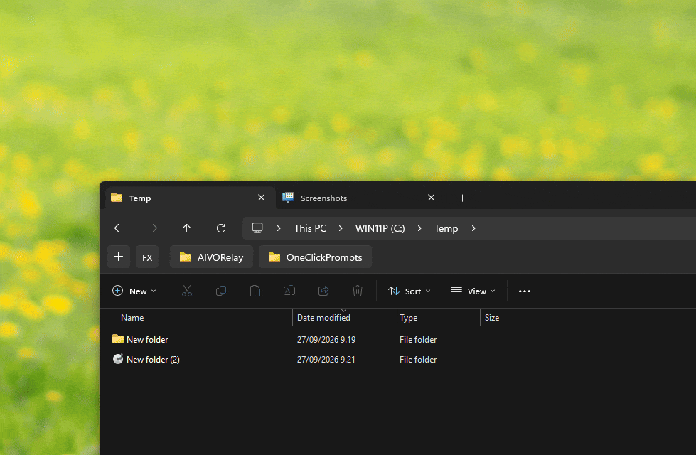

# Explorer Folder Bookmarks Bar

A [Windhawk](https://windhawk.net/) mod for Windows 11 File Explorer on x64 and ARM64 that adds folder bookmarks below the address bar. The [production source](mods/explorer-folder-bookmarks-bar.wh.cpp) supports up to 32 bookmarks, adapts from one to four rows, and scrolls horizontally when needed.

  

## Install

The mod is not yet in Windhawk's catalog. To install it locally:

1. Install Windhawk. If **Create a new mod** is hidden, enable developer mode. Create a mod or open your existing `explorer-folder-bookmarks-bar` in editing mode.
2. Replace the entire contents of Windhawk's `mod.wh.cpp` editor tab with the [production source](mods/explorer-folder-bookmarks-bar.wh.cpp), then click **Compile Mod**.
3. Turn on **Enable mod**, exit editing mode, and open a new File Explorer window.

The bar appears in newly opened windows. Windows that were already open when
the mod was enabled or updated may remain unchanged; open a new window to use
the bar. This is the supported activation path for stability.

## Use

- Click **+** to bookmark the active filesystem folder. Click a bookmark to navigate there; Ctrl+click opens it in a new tab.
- Drag bookmarks to reorder them. Middle-click removes a bookmark from the bar without deleting its folder. Hover to see its full path. Icons come from Windows Shell.
- Left-click **FX** for your profile folder, Desktop, Documents, Downloads, and custom folders. Right-click **FX** for all drives. Ctrl+click a menu item to open it in a new tab.
- Set **FX custom folders** in the mod's Windhawk settings. The blank default entry adds no shortcut; enter an absolute path and optional label. Environment variables are supported. Local, network and removable-drive folders all work: a folder missing from a local disk is hidden, while network and removable entries are shown unchecked, like bookmarks. Open a new Explorer window after changing settings.
- Right-click **+** to save or load a bookmark backup using a file dialog. Bookmarks also persist in Windhawk's local mod storage.

Licensed under [MIT](LICENSE).

## Additional version

The [Double Decker source](explorer-folder-bookmarks-bar-double.wh.cpp) has two independent, horizontally scrollable rows with separate bookmark lists. It includes the production startup hook and FX settings improvements but **has not been tested in File Explorer**. Both files use the same mod ID, so compile only one at a time.

## Other projects by MaxITService

- [AivoRelay](https://github.com/MaxITService/AIVORelay) — voice to text for Windows.
- [OneClickPrompts](https://github.com/MaxITService/OneClickPrompts) — prompt shortcuts for AI chats.
- [Console2Ai](https://github.com/MaxITService/Console2Ai) — send a PowerShell buffer to AI.
- [Ping-Plotter-PS51](https://github.com/MaxITService/Ping-Plotter-PS51) — a PowerShell ping plotter.
